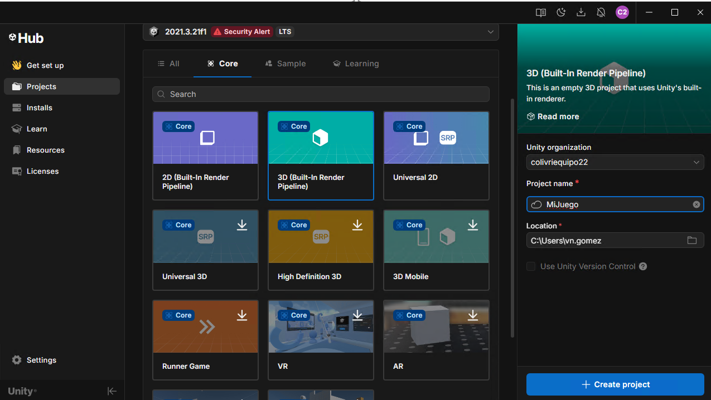
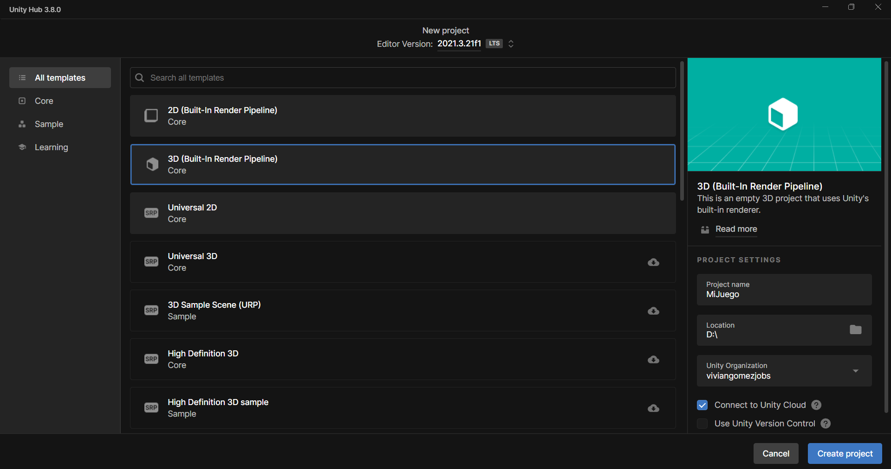
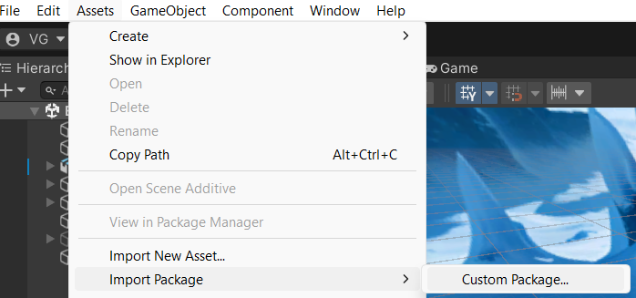
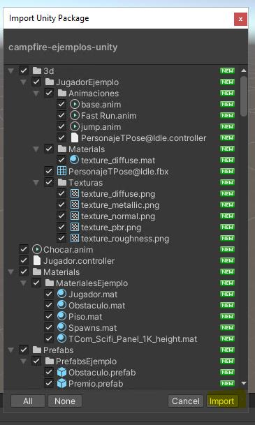
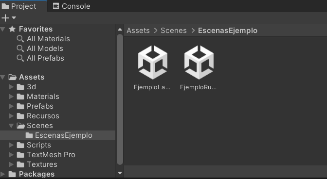

# 0. Preparación (instalación rápida)

!!! info "Objetivo de esta sección"
    Crear tu proyecto en unity desde cero y descargar los ejemplos para que puedas aprender y reutilizar recursos en tu juego.

!!! tip "🙋‍♀️ Ayuda"
    🙋‍♀️ No olvides preguntarle a los mentores de Campfire si necesitas ayuda.

---

## 0.1 Crear el proyecto

!!! example "Actividad"
    1. Abre el programa **Unity Hub**.
    2. Ve a la pestaña "Projects", selecciona la versión Unity [2021.3.21f1](https://download.unity3d.com/download_unity/1b156197d683/Windows64EditorInstaller/UnitySetup64-2021.3.21f1.exe)
    3. Luego, busca el botón **New project** y dale click.
    4. Elige "Core" y la plantilla **3D (Core)**.
    5. Ponle un nombre al proyecto, este puede ser general o el nombre que quieres darle a tu juego (ej: `MiJuego`).
    6. Pon en Location (o Ubicacion) la carpeta dcon el nombre del proyecto que creaste en Github
    6. Clic en **Create Project**.

📸 **Si tienes la última versión de Unity Hub**  

📸 **Si tienes versiones anteriores de Unity Hub**  

---

## 0.2 Importar el "paquete de herramientas para Campfire" (un _.unitypackage_)

!!! example "Actividad"
    1. Abre el enlace: **[https://github.com/VivianGomez/EjemplosPrincipiantesUnity/releases/tag/v1.0-campfire](https://github.com/VivianGomez/EjemplosPrincipiantesUnity/releases/tag/v1.0-campfire)**
    2. Busca y descarga el archivo llamado **`campfire-ejemplos-unity.unitypackage`**.
    3. Una vez finalice la descarga, en Unity, ve a **Assets → Import Package → Custom Package…**
    4. Se abrirá el explorador de archivos, selecciona el `.unitypackage` que descargaste.
    5. Clic en **Import**.

📸 **Ventana Assets → Import Package → Custom Package**  

📸 **Dar click en "import"**  

!!! warning "Ojo"
    Si aparece algún aviso de versión de Unity, acéptalo y continúa.  
    Los errores **rojos** en la **Console** sí debes reportar a los mentores de Campfire.

---

## 0.3 Abrir escenas del taller

!!! example "Actividad"
    En el panel **Project**, busca la carpeta de escenas del paquete  
    (ej: `Assets/Scenes/`) y abre:

    - `EjemploRunner`
    - `EjemploLaberinto`

    Haz doble clic en cada escena para abrirla.

📸 **Así encontrarás la carpeta Scenes en Project:**  

---

## ✅ Checklist (antes de seguir)

Marca cada ítem cuando lo hayas comprobado:

<ul class="cf-checklist">
  <li><label><input type="checkbox"> El proyecto abre <strong>sin errores rojos</strong> en la Console</label></li>
  <li><label><input type="checkbox"> Puedo abrir la escena <code>EjemploRunner</code></label></li>
  <li><label><input type="checkbox"> Puedo abrir la escena <code>EjemploLaberinto</code></label></li>
</ul>

!!! success "¡Listo!"
    Si tienes los tres puntos marcados, continúa con **[1. Tour rápido por Unity](01-tour-unity.md)**.
