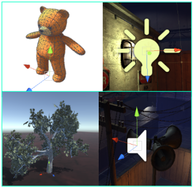
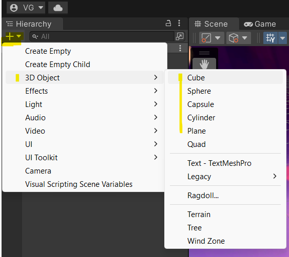
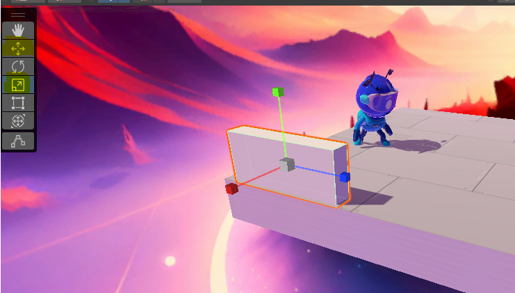

# 1. Tour rápido por Unity (5–10 min)

!!! info "Objetivo de esta sección"
    Conocer las ventanas principales de Unity para poder orientarte durante el taller.

---

## Las ventanas importantes

| Ventana | ¿Para qué sirve? |
|---------|-----------------|
| **Hierarchy** | Lista de objetos en la escena actual |
| **Scene** | Vista 3D donde editas la escena |
| **Game** | Vista de lo que "juega" la cámara (se muestra cuando das click en el botón "Play" ▶ ubicado en la mitad superior de la pantalla) |
| **Inspector** | Donde cambias componentes y valores de un objeto |
| **Project** | Archivos del proyecto (scripts, prefabs, escenas) |
| **Console** | Mensajes, advertencias y errores ( esta justo en la zona de Project, es una pestaña (pídele a los emntores que te ayuden si no la encuentras)) |
| **Toolbar** | Barra de controles que permite mover, rotar y escalar los objetos de juego |

📸 **Aquí puedes ver las ventanas de Unity y sus nombres**  

---

## Concepto clave: GameObject y Component

!!! note "Idea central"
    Un **GameObject** es como un "contenedor vacío" en la escena.  
    Por sí solo no hace nada; su comportamiento y apariencia dependen de los **Componentes** que tenga.

    Cada objeto en Unity es un **GameObject + sus Components**.

### ¿Qué es un GameObject?

- Es la unidad básica de Unity: personajes, cámaras, luces, suelos, premios… todo es un GameObject.  
- Aparece en la **Hierarchy** con un nombre y puede tener hijos (objetos anidados).  
- Siempre tiene al menos un componente: **Transform**.

!!! example "Actividad"
    Un objeto de juego es, por ejemplo, cualquier objeto 3d, como un cubo, una esfera, un cilindro, un plano o una cápsula. En Unity estos son la base para contruir cualquier entorno de un juego. 
    **Crea tu primer GameObject:** Un cubo que "aplastarás" para formar una pared que ayude a nuestro personaje a no caerse al avismo. Para ello, busca el símbolo "+" en la ventana Hierarchy, luego ve a **3D Object > Cube**. 
    Para moverlo y "aplastarlo", usa la "Toolbar" (observa las imágenes de ejemplo abajo y si necesitas ayuda, llama alos mentores) 

### ¿Qué es un Component?

Un Component es una "pieza de funcionalidad" que se adhiere a un GameObject:

| Component | ¿Qué hace? |
|-----------|-----------|
| **Transform** | Guarda posición, rotación y escala del objeto en la escena. Todos los GameObjects lo tienen. |
| **Collider** | Define la forma de colisión (caja, esfera, cápsula…) para detectar choques. |
| **Rigidbody** | Activa la física: gravedad, masa, fuerzas. Sin él, el objeto no cae. |
| **MeshRenderer** | Renderiza la malla 3D visible del objeto. |
| **Animator** | Controla las animaciones del objeto. |
| **Script (MonoBehaviour)** | Código C# que tú escribes para darle comportamiento personalizado. |

!!! tip "Cómo ver los componentes"
    Selecciona cualquier objeto en la **Hierarchy** y mira el **Inspector**: verás todos sus componentes listados uno debajo del otro.

!!! example "Ejemplo: el jugador del Runner"
    El GameObject `Jugador` tiene:

    - **Transform** – su posición en la pista.  
    - **Rigidbody** – para que la gravedad lo afecte y pueda saltar.  
    - **Collider** (cápsula) – para detectar cuándo toca el suelo o un obstáculo.  
    - **Animator** – para la animación de correr/saltar.  
    - **PlayerController** (Script) – el código que lee el teclado y mueve al jugador.

---

## Play Mode

!!! warning "¡Importante! Cambios en Play se pierden"
    - Cuando presionas **▶ Play**, puedes probar el juego (¿qué pasa si mueves el jugador hacia la "pared" que creaste? y ¿qué pasa si lo mueves hacia el otro lado?).
    - Cuando presionas **■ Stop**, Unity vuelve al estado **anterior al Play**.
    - Si cambias valores en Play, **casi siempre se pierden** al detener.

    Guarda tus cambios importantes **antes** de entrar en Play.

!!! example "Mini reto – experimenta"
    1. Presiona **Play**.
    2. En el **Inspector**, cambia un valor (por ejemplo el color del piso).
    3. Presiona **Stop** y observa: ¿sigue el cambio?

---

## ✅ Checklist

Marca cada ítem cuando lo hayas comprobado:

<ul class="cf-checklist">
  <li><label><input type="checkbox"> Identifico las 6 ventanas principales en Unity (<strong>Hierarchy, Scene, Game, Inspector, Project, Console</strong>)</label></li>
  <li><label><input type="checkbox"> Entiendo qué es un <strong>GameObject</strong> y para qué sirve</label></li>
  <li><label><input type="checkbox"> Entiendo qué es un <strong>Component</strong> y puedo listar al menos 3</label></li>
  <li><label><input type="checkbox"> Sé que <strong>Transform</strong> está en todos los GameObjects</label></li>
  <li><label><input type="checkbox"> Sé que los cambios en <strong>Play</strong> se pierden al detener</label></li>
</ul>
