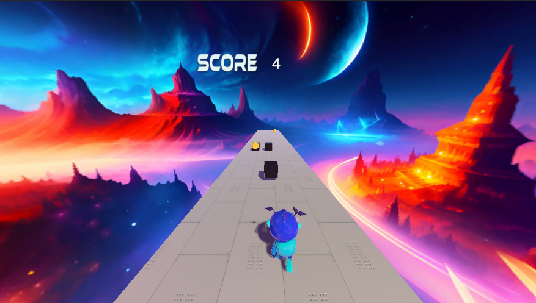
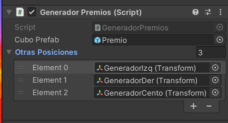
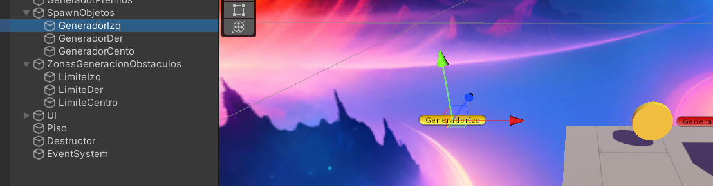
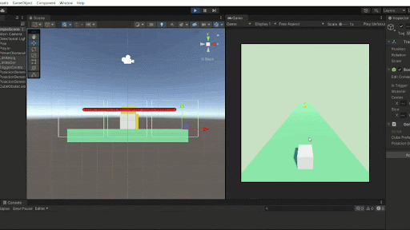

# 2. Ejemplo1: Juego _Runner_

!!! info "Objetivo de esta sección"
    Entender cómo funciona el Runner: el jugador se mueve en el eje X y **el mundo viene hacia él**.  
    Explorarás los scripts, harás cambios en el **Inspector** y luego en el **código**.



!!! tip "🙋‍♀️ Ayuda"
    🙋‍♀️ No olvides preguntarle a los mentores de Campfire si necesitas ayuda.

En este ejemplo el jugador **no avanza hacia adelante**.  
El truco es: **premios y obstáculos se mueven hacia el jugador**.

---

## 2.1 Objetivo del juego

!!! success "Meta"
    - Muévete **izquierda/derecha** para evitar obstáculos y recoger premios.
    - Sobrevive el mayor tiempo posible; los puntos suben solos con el tiempo.
    - Cada premio suma puntos extra; cada obstáculo los resta.

---

## 2.2 Encuentra el Jugador en la escena

!!! example "Actividad — Inspector primero"
    1. Abre la escena `Assets/Scenes/EscenasEjemplo/EjemploRunner.unity` (doble clic).
    2. En el panel **Hierarchy** (izquierda), localiza el objeto llamado **`Jugador`**.
    3. Haz clic en él para **seleccionarlo**.
    4. Mira el panel **Inspector** (derecha) y analiza qué componentes tiene. <br>
    Si, los viste en el paso anterior, pero ahora vamos a entender como los usamos para programar el juego.

!!! note "Repasemos ... ¿Qué deberías ver en el Inspector?"
    - **Transform** – posición, rotación, escala.
    - **Rigidbody** – física (gravedad, masa).
    - **Capsule Collider** – forma para detectar colisiones.
    - **Player Controller (Script)** – el script que controla todo, este lo programa cada desarrollador, nosotros hicimos un ejemplo de como agregar un componente script que, en este caso, **hace que el jugador se mueva y ... algunas cosas más**.
    - **Animator** – controla las animaciones de correr/saltar.

---

## 2.3 Código: `PlayerController.cs`

**Ruta:** `Assets/Scripts/ScriptsEjemplo/EjemploRunner/PlayerController.cs`

Este script es el cerebro del jugador. Tiene tres partes importantes:

=== "Start() – preparar el juego"

    ```csharp
    void Start()
    {
        txtPuntos.text = "0";   // ← pone el marcador en 0 al iniciar
    }
    ```

    !!! abstract "Mini teoría: ¿Qué es Start()?"
        `Start()` se ejecuta **una sola vez** cuando comienza el juego (cuando presionas Play).  
        En palabras muy simples, lo usamos opara decirle al juego que valores o condiciones se tendrán al iniciar el juego... ej: preparar variables o poner valores iniciales.

=== "Update() – el bucle del juego"

    ```csharp
    private void Update()
    {
        AumentarScoreSupervivencia();   // sube puntos con el tiempo

        Correr();     // lee flechas ← → y mueve al jugador
        Saltar();     // lee Barra Espaciadora y aplica impulso
    }
    ```

    !!! abstract "Mini teoría: ¿Qué es Update()?"
        `Update()` se ejecuta **una vez por frame** (60 veces por segundo aprox.).  
        Todo lo que quieras que ocurra continuamente va aquí: movimiento, lectura de teclas, etc.

=== "Detección de eventos (ej: score)"

    ```csharp
    float penalizacion = 5;   // puntos que se restan al tocar un obstáculo
    float aumento = 4;        // puntos que se suman al recoger un premio

    //Esta fruncion permite detectar que algo "choca" (o "colisiona") con el objeto que tiene el script, en este caso el jugador
    private void OnTriggerEnter(Collider other)
    {
        if (other.name.Contains("Obstaculo")) //Si choca con un obstáculo...
        {
            score -= penalizacion;        // resta puntos
            Destroy(other.gameObject);    // elimina el obstáculo
        }
        else if (other.name.Contains("Premio")) // Si choca con un premio...
        {
            score += aumento;             // suma puntos
            Destroy(other.gameObject);    // elimina el premio
        }
    }
    ```

---

## 2.4 Actividad guiada: Start vs Update (comentar/descomentar)

!!! example "Actividad – experimenta con Update()"
    **Objetivo:** ver qué pasa cuando desactivas partes del Update().

    1. En el panel **Project**, navega a `Assets/Scripts/ScriptsEjemplo/EjemploRunner/`.
    2. Haz doble clic en **`PlayerController.cs`** para abrirlo en Visual Studio / VS Code.
    3. Busca el método `Update()`:

    ```csharp
    private void Update()
    {
        AumentarScoreSupervivencia();
        Correr();
        Saltar();
    }
    ```

    **Experimento 1 – Sin movimiento lateral:**

    Comenta la línea `Correr()` poniendo `//` delante:
    ```csharp
    private void Update()
    {
        AumentarScoreSupervivencia();
        // Correr();   // ← comentada
        Saltar();
    }
    ```
    Guarda (`Ctrl+S`), vuelve a Unity, presiona **Play**.  
    ➡️ ¿Qué pasa? El jugador ya no se mueve izquierda/derecha.

    **Experimento 2 – Sin puntos automáticos:**

    Restaura `Correr()` y ahora comenta `AumentarScoreSupervivencia()`:
    ```csharp
    private void Update()
    {
        // AumentarScoreSupervivencia();   // ← comentada
        Correr();
        Saltar();
    }
    ```
    Guarda, presiona **Play**.  
    ➡️ ¿Qué pasa? El marcador se queda en 0 (solo cambia al recoger premios/obstáculos).

    **Al terminar:** quita todos los `//` para dejar el código original y guarda.

!!! success "¿Qué deberías observar?"
    Cada línea dentro de `Update()` controla **una función diferente**.  
    Comentar una línea es como "apagar" esa función sin borrar el código.

!!! warning "Si no funciona revisa…"
    - ¿Guardaste el archivo antes de volver a Unity? (`Ctrl+S`)
    - ¿Volviste a presionar **Play** después de guardar?
    - ¿Quitaste los `//` al final del experimento?

---

## 2.5 Premios: aparecen solos cada cierto tiempo

**Ruta del script:** `Assets/Scripts/ScriptsEjemplo/EjemploRunner/GeneradorPremios.cs`

```csharp
public class GeneradorPremios : MonoBehaviour
{
    public GameObject cuboPrefab;           // el objeto de juego del premio
    public Transform[] otrasPosiciones;     // posiciones donde puede aparecer

    private void Start()
    {
        // Llama a "GenerarPremios" cada 3 segundos (empieza inmediatamente)
        InvokeRepeating("GenerarPremios", 0f, 3f);
        //                                ↑    ↑
        //                     espera inicial  intervalo
    }

    public void GenerarPremios()
    {
        // se genera un npumero aleatorio entre 0 y el tamaño del arreglo de posiciones (en este caso: 3) 
        int randomIndex = Random.Range(0, otrasPosiciones.Length);
        //La función Instantiate de unity permite "generar replicas" de un GameObject (estos 'replicables' son de color azul y los llamamos Prefabs, si quieres profundizar por qué consulta con un mentor)
        Instantiate(cuboPrefab, otrasPosiciones[randomIndex].position, Quaternion.identity);
    }
}
```
!!! example "Actividad — Nombre de la _variable_ que representa al premio"
    1. ¿Notaste que el objeto de juego del premio está representado por una _variable_ llamada cuboPrefab? Eso es extraño, porque el premio es una moneda. Cuando creas _variables_ estas pueden llamarse como tu quieras, así que para mejorar el código te pedimos que cambies el nombre de esa _variable_ de "cuboPrefab" a "premio".
    2. Guarda los cambios del script (`Ctrl+S`)
    3. Nota que esto no cambia el comportamiento del juego, pero mejora el entendimiento del script.<br>
    Nota: si no conoces el conceptio de _variable_, preguntale a los mentores, ellos te explicarán qué es, para qué sirve y cómo se usa.
---

!!! example "Actividad — Inspector"
    1. En **Hierarchy**, haz clic en el objeto `GeneradorPremios`.
    2. En **Inspector** verás el script con dos campos:
        - **Premio** – el objeto de juego del premio asignado ("Premio" debe ser el nombre si lo cambiaste en el paso anterior, de lo contrario dirá "Cubo Prefab"). 
        - **Otras Posiciones** – Un conjunto de elementos (creado como un "arreglo" o _array_), en este caso, para guardar las posiciones donde puede aparecer el premio.
    3. Expande el arreglo (⯈ Otras posiciones) y encuentra el objeto asociado al "Element 0" donde se generan los premios. Intenta acceder al objeto de juego de esa "posición".
    4. Presiona **Play**, observa cómo aparecen premios cada ~3 segundos y qué ocurre con los premios generados en la posición que moviste.

---
Así expandes el arreglo de ⯈ Otras posiciones

Así puedes mover la posición



## 2.6 Obstáculos: aparecen al cruzar límites (triggers)

**Ruta del script:** `Assets/Scripts/ScriptsEjemplo/EjemploRunner/GenerarCubos.cs`

```csharp
public class GenerarCubos : MonoBehaviour
{
    public GameObject cuboPrefab;
    public Transform posicionGeneradora;
    public Transform[] otrasPosiciones;

    private void OnTriggerEnter(Collider other)
    {
        // Solo genera si el Jugador chocó con el objeto dueño de este script
        if (other.gameObject.name == "Jugador")
        {
            int randomIndex = Random.Range(0, otrasPosiciones.Length);
            Instantiate(cuboPrefab, posicionGeneradora.position, Quaternion.identity);
            Instantiate(cuboPrefab, otrasPosiciones[randomIndex].position, Quaternion.identity);
        }
    }
}
```

!!! example "Actividad — Inspector"
    1. En **Hierarchy**, expande `ZonasGeneracionObstaculos`.
    2. Selecciona `LimiteCentro` (o `LimiteIzq` / `LimiteDer`).
    3. En **Inspector** confirma:
        - `Box Collider` con **Is Trigger ✅** activado.
        - Script `GenerarCubos` con su prefab asignado.
    4. Presiona **Play** y cruza el carril central: aparece un obstáculo.

!!! note "¿Cómo funciona?"
    Los objetos límite tienen **Triggers** invisibles.  
    Cuando el jugador los cruza, `OnTriggerEnter` instancia obstáculos en el carril.

---

Observa en esta imagen como funciona la generación de cubos con los GameObjects "Limite", únicamente usando sus componentes BoxCollider con Trigger ✅


!!! example "Actividad — Inspector"
    1. En **Inspector** intenta cambiar en **uno** de los game objects "Limite":
        - `Box Collider` con **Is Trigger ⬜** (desactivado).
    2. Ejecuta el juego
    3. Observa como cambia la colisión contra ese objeto "Limite"

## 2.7 El truco del Runner: el mundo se mueve hacia ti

**Ruta del script:** `Assets/Scripts/ScriptsEjemplo/EjemploRunner/MovimientoObjeto.cs`

```csharp
public class MovimientoObjeto : MonoBehaviour
{
    public Rigidbody rb; //se accede el componente de física (rigidbody)
    public float rapidez = 8f;   // ← velocidad a la que se mueve hacia el jugador

    void FixedUpdate()
    {
        // Mueve el objeto en el eje Z negativo (hacia el jugador)
        Vector3 velocidad = new Vector3(0, 0, -rapidez);

        // Se accede a la velocidad y se actualiza con el vector modificado
        rb.velocity = velocidad;
    }

    private void OnTriggerEnter(Collider other)
    {
        // Si llega al objeto "Destructor", se elimina solo
        if (other.name == "Destructor")
        {
            //Esta función destruye un GameObject
            Destroy(gameObject);
        }
    }
}
```
!!! example "Actividad — Inspector"
    1. Quita el signo "-" en el eje Z del vector de velocidad:   (0, 0, rapidez)
    2. Guarda los cambios del script (`Ctrl+S`)
    3. Ejecuta el juego y observa que ocurre con el movimiento de los objetos tras hacer ese cambio.
        
---


!!! abstract "Mini teoría: FixedUpdate()"
    `FixedUpdate()` es como `Update()` pero para **física**.  
    Se ejecuta a intervalos fijos (ej: 50 veces/segundo) para que el movimiento sea suave y preciso.

!!! example "Actividad — Inspector"
    1. En el panel **Project**, busca la carpeta `Assets/Prefabs/` (o similar).
    2. Selecciona el prefab `Premio` u `Obstaculo`.
    3. En **Inspector** verás el script `MovimientoObjeto` con el campo **Rapidez**.
    4. Observa el valor actual (debería ser `8`).

---

## 🎯 Mini retos del Runner (paso a paso)

### Reto R-1 – Cambia la velocidad de premios/obstáculos (Inspector)

!!! example "Paso a paso"
    **Antes de tocar código**, cambia el valor directamente en el Inspector:

    1. En el panel **Project**, localiza el prefab de premio u obstáculo  
       (busca en `Assets/Prefabs/` o usa la barra de búsqueda con "Premio").
    2. Selecciónalo.
    3. En **Inspector**, en el script `MovimientoObjeto`, cambia el campo **Rapidez** de `8` a `12`.
    4. Presiona **Play** y prueba 30 segundos.

!!! success "¿Qué deberías ver?"
    Los premios y obstáculos llegan **más rápido**. El juego se siente más desafiante.

!!! warning "Si no ves cambios revisa…"
    - ¿Seleccionaste el **prefab** (en Project) y no una instancia en Hierarchy?
    - ¿Estás mirando el campo correcto (`Rapidez`, no otro)?

**Después (si quieres, en código):**

Abre `Assets/Scripts/ScriptsEjemplo/EjemploRunner/MovimientoObjeto.cs` y cambia:
```csharp
public float rapidez = 8f;   // ← cambia a 12f
```

---

### Reto R-2 – Más premios (Inspector primero)

!!! example "Paso a paso"
    1. En **Hierarchy**, haz clic en `GeneradorPremios`.
    2. En **Inspector** verás el script. Observa los campos disponibles.
    3. Presiona **Play** y cuenta cuántos premios aparecen por minuto.
    4. Sal de Play.

    **Ahora en código:**  
    Abre `Assets/Scripts/ScriptsEjemplo/EjemploRunner/GeneradorPremios.cs`.  
    Busca esta línea en `Start()`:
    ```csharp
    InvokeRepeating("GenerarPremios", 0f, 3f);
    ```
    Cambia `3f` (cada 3 segundos) a `1.5f` (cada 1.5 segundos):
    ```csharp
    InvokeRepeating("GenerarPremios", 0f, 1.5f);
    ```
    Guarda (`Ctrl+S`), vuelve a Unity, presiona **Play**.

!!! success "¿Qué deberías ver?"
    Aparecen **el doble de premios**. ¡Más oportunidades de sumar puntos!

---

### Reto R-3 – Cambia cuántos puntos da un premio (código)

!!! example "Paso a paso"
    1. En **Hierarchy**, selecciona `Jugador`.
    2. En **Inspector**, en el script `Player Controller`, observa los campos.  
       (Nota: `penalizacion` y `aumento` son variables privadas, no aparecen en Inspector).
    3. Abre `Assets/Scripts/ScriptsEjemplo/EjemploRunner/PlayerController.cs`.
    4. Busca al inicio de la clase:
    ```csharp
    float penalizacion = 5;
    float aumento = 4;
    ```
    5. Cambia `aumento` a `10`:
    ```csharp
    float aumento = 10;   // ← un premio ahora da 10 puntos en vez de 4
    ```
    6. Guarda, vuelve a Unity, presiona **Play** y recoge un premio.

!!! success "¿Qué deberías ver?"
    El contador sube de golpe **10 puntos** al tocar un premio.

!!! tip "Bonus"
    Cambia también `penalizacion` a `1` para que el jugador no pierda tantos puntos  
    al chocar con obstáculos. ¿Cambia la estrategia del juego?

---

## ✅ Checklist del Runner

Marca cada ítem cuando lo hayas completado:

<ul class="cf-checklist">
  <li><label><input type="checkbox"> Abrí la escena <code>EjemploRunner</code> y encontré el objeto <code>Jugador</code> en Hierarchy</label></li>
  <li><label><input type="checkbox"> Vi los componentes del <code>Jugador</code> en Inspector (Rigidbody, Script, Collider)</label></li>
  <li><label><input type="checkbox"> Entiendo la diferencia entre <code>Start()</code> y <code>Update()</code></label></li>
  <li><label><input type="checkbox"> Comenté/descomentée líneas en <code>Update()</code> y vi el efecto en Play</label></li>
  <li><label><input type="checkbox"> Encontré <code>GeneradorPremios</code> en Hierarchy y vi sus campos en Inspector</label></li>
  <li><label><input type="checkbox"> Identifiqué los Triggers de <code>ZonasGeneracionObstaculos</code> (Is Trigger ✓)</label></li>
  <li><label><input type="checkbox"> Encontré el script <code>MovimientoObjeto</code> y la variable <code>rapidez</code></label></li>
  <li><label><input type="checkbox"> Completé al menos un mini reto (R-1, R-2 o R-3)</label></li>
</ul>
