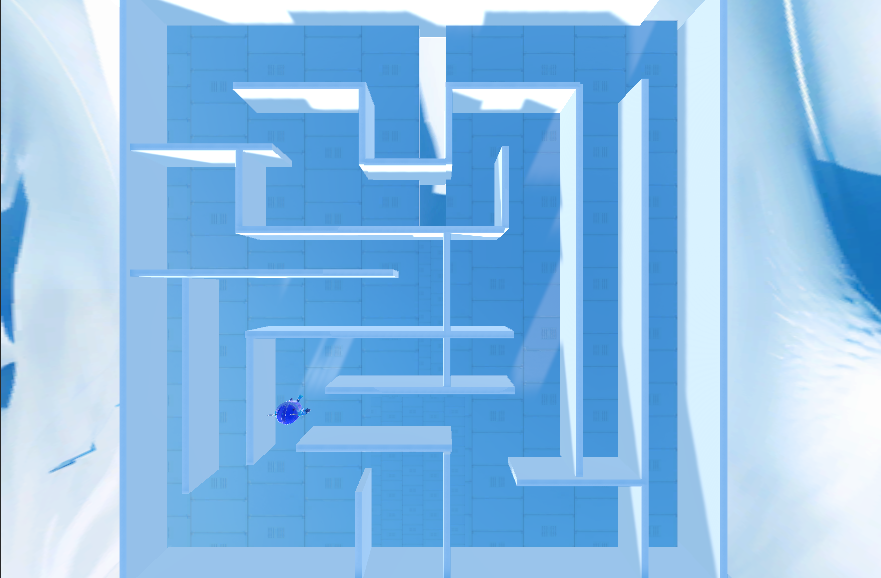
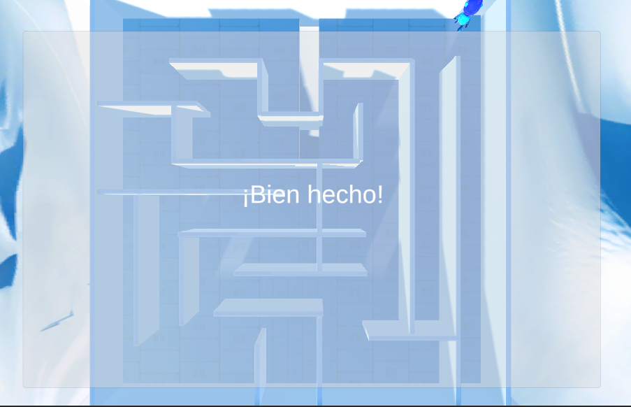
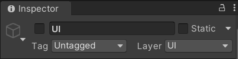

# 3. Ejemplo2: Juego _Laberinto_

!!! info "Objetivo de esta sección"
    Explorar el laberinto: el jugador recorre el escenario y al llegar a la **Meta** se activa un evento de victoria.  
    Explorarás los scripts, harás cambios en el **Inspector** y luego en el **código**.




!!! tip "🙋‍♀️ Ayuda"
    🙋‍♀️ No olvides preguntarle a los mentores de Campfire si necesitas ayuda.

---

## 3.1 Objetivo del juego

!!! success "Nuevos elementos"
    - Tener una **Meta** de llegada (en el espacio 3d) y detectar que se lleva a ella.
    - Al entrar en la zona de Meta:
        - Aparece un Canvas de victoria con "¡Ganaste!".
        - Indicar el final del juego con un mensaje en UI.
    - Este juego incluye un tipo de movimiento diferente al del Runner, pues acá te puedes mover libremente por todo el entorno.
    La implementación del Player es diferente, pues usa un componente llamado **Character Controller**, en lugar de usar rigidbody. Te lo explicaremos detalladamente.




---

## 3.2 Jugador del laberinto

!!! example "Actividad — Inspector primero"
    1. Abre la escena `Assets/Scenes/EscenasEjemplo/EjemploLaberinto.unity` (doble clic).
    2. En **Hierarchy**, haz clic en el objeto `Jugador`.
    3. En **Inspector** observa sus componentes:
        - **Character Controller** – maneja el movimiento sin física de Rigidbody.
        - **Movimiento Jugador (Script)** – controla dirección, salto y gravedad.
        - **Animator** – controla las animaciones de correr/saltar/estar quieto.
    4. En el script `Movimiento Jugador`, anota los valores de los campos públicos:
        - `Velocidad` (por defecto `5`)
        - `Altura Salto` (por defecto `0.5`)
        - `Velocidad Rotacion` (por defecto `10`)

---

## 3.3 Código: `MovimientoJugador.cs`

**Ruta:** `Assets/Scripts/ScriptsEjemplo/EjemploLaberinto/MovimientoJugador.cs`

Este script controla **todo el movimiento** del personaje del laberinto.

=== "Variables públicas"

    ```csharp
    public float velocidad = 5f;           // qué tan rápido se mueve
    public float alturaSalto = 0.5f;       // qué tan alto salta
    public float gravedad = -9.8f;         // fuerza de gravedad (negativa = hacia abajo)
    public float velocidadRotacion = 10f;  // qué tan rápido gira al moverse
    ```

    !!! abstract "Mini teoría: variables `public`"
        Las variables marcadas con `public` **se pueden editar desde el Inspector** de Unity  
        sin tener que abrir el código. ¡Por eso puedes cambiarlas directamente ahí!


=== "Start() – preparar componentes"

    ```csharp
    void Start()
    {
        // con GetComponent se obtiene un componente del objeto de jeugo
        // en este caso, el CharacterController (¡si! el mismo que visualizas en el Inspector)
        controlador = GetComponent<CharacterController>();   
        
         // y aquí se obtiene el componente Animator
        animador = GetComponent<Animator>();                
    }
    ```

    !!! abstract "Mini teoría: Recordemos ... ¿Qué es Start()?"
        `Start()` se ejecuta **una sola vez** al comenzar el juego.  
        Aquí se guardan referencias a componentes para usarlas después.

=== "Update() – movimiento por frame"

    ```csharp
    void Update()
    {
        // Leer entrada del teclado (flechas o WASD)
        float entradaHorizontal = Input.GetAxis("Horizontal");
        float entradaVertical   = Input.GetAxis("Vertical");
        Vector3 direccion = new Vector3(entradaHorizontal, 0, entradaVertical);

        if (direccion.magnitude > 0.1f)
        {
            // Rotar hacia la dirección de movimiento
            Quaternion rotacionObjetivo = Quaternion.LookRotation(direccion);
            transform.rotation = Quaternion.Lerp(
                transform.rotation,
                rotacionObjetivo,
                velocidadRotacion * Time.deltaTime
            );
            animador.SetBool("run", true);   // activar animación de correr
        }
        else
        {
            animador.SetBool("run", false);  // activar animación de quieto
        }

        // Saltar (solo si está en el suelo)
        if (controlador.isGrounded)
        {
            if (velocidadVertical < 0) velocidadVertical = -2f;

            if (Input.GetKeyDown(KeyCode.Space))
            {
                // Fórmula: V = √(-2 × gravedad × alturaSalto)
                velocidadVertical = Mathf.Sqrt(alturaSalto * -2f * gravedad);
                animador.SetTrigger("jump");
            }
        }

        // Aplicar gravedad cada frame
        velocidadVertical += gravedad * Time.deltaTime;

        // Movimiento final: dirección × velocidad + gravedad en Y
        Vector3 movimiento = direccion * velocidad;
        movimiento.y = velocidadVertical;
        controlador.Move(movimiento * Time.deltaTime);
    }
    ```

    !!! abstract "Mini teoría: Recordemos ... ¿Qué es Update()?"
        `Update()` se ejecuta **una vez por frame** (~60 veces por segundo).  
        Todo lo que deba ocurrir continuamente va aquí: leer teclas, mover, girar.

---


## 3.4 Actividad guiada: Start vs Update (comentar/descomentar)

!!! example "Actividad — experimenta con Update()"
    **Objetivo:** ver qué pasa al comentar secciones del Update().

    1. Abre `Assets/Scripts/ScriptsEjemplo/EjemploLaberinto/MovimientoJugador.cs`.
    2. Busca en `Update()` el bloque de rotación y anímación:

    **Experimento 1 – Sin rotación automática:**

    Comenta el bloque de rotación (agrega `//` delante de las líneas de `Quaternion`):
    ```csharp
    if (direccion.magnitude > 0.1f)
    {
        // Quaternion rotacionObjetivo = Quaternion.LookRotation(direccion);
        // transform.rotation = Quaternion.Lerp(
        //     transform.rotation,
        //     rotacionObjetivo,
        //     velocidadRotacion * Time.deltaTime
        // );
        animador.SetBool("run", true);
    }
    ```
    Guarda (`Ctrl+S`), vuelve a Unity, presiona **Play**.  
    ➡️ El personaje se mueve pero **no gira** hacia donde camina.

    **Experimento 2 – Sin salto:**

    Restaura lo anterior. Luego comenta todo el bloque `if (Input.GetKeyDown(KeyCode.Space))`:
    ```csharp
    // if (Input.GetKeyDown(KeyCode.Space))
    // {
    //     velocidadVertical = Mathf.Sqrt(alturaSalto * -2f * gravedad);
    //     animador.SetTrigger("jump");
    // }
    ```
    Guarda, presiona **Play**.  
    ➡️ El personaje ya **no puede saltar** (barra espaciadora sin efecto).

    **Experimento 3 – Sin gravedad:**

    Comenta la línea que aplica gravedad:
    ```csharp
    // velocidadVertical += gravedad * Time.deltaTime;
    ```
    Guarda, presiona **Play**.  
    ➡️ El personaje **flota** en el aire al saltar (no cae).

    **Al terminar:** quita todos los `//` para dejar el código original y guarda.

!!! success "¿Qué deberías observar?"
    Cada sección del `Update()` controla un aspecto diferente del movimiento.  
    Comentar código es una herramienta para **experimentar y aprender** sin borrar nada.

!!! warning "Si no funciona revisa…"
    - ¿Guardaste el archivo antes de volver a Unity? (`Ctrl+S`)
    - ¿Presionaste **Play** después de guardar?
    - Si Unity muestra errores rojos, revisa que los `//` estén al inicio de cada línea.

---

## 3.5 La Meta usando Trigger para detectar un "evento"

**Ruta del script:** `Assets/Scripts/ScriptsEjemplo/EjemploLaberinto/DeteccionEvento.cs`

```csharp
public class DeteccionEvento : MonoBehaviour
{
    [Header("Objeto que puede activar el evento (ej: Jugador)")]
    public GameObject objetoActivador;   // ← aquí se asigna el Jugador

    [Header("Objeto que se muestra al detectar (ej: Canvas)")]
    public GameObject objetoAMostrar;    // ← aquí se asigna el Canvas de victoria

    void Start()
    {
        // Al inicio, el Canvas de victoria está oculto
        if (objetoAMostrar != null)
            objetoAMostrar.SetActive(false);
    }

    void OnTriggerEnter(Collider otro)
    {
        // Si el objeto que entró al Trigger tiene el mismo nombre que el activador…
        if (otro.name.Equals(objetoActivador.name))
        {
            objetoAMostrar.SetActive(true);   // ← muestra el Canvas de victoria
        }
    }
}
```


!!! example "Actividad — Inspector"
    1. En **Hierarchy**, haz clic en el objeto `Meta`.
    2. En **Inspector** confirma:
        - `Box Collider` con **Is Trigger ✓** activado.
        - Script `Deteccion Evento` con:
            - **Objeto Activador** → `Jugador`
            - **Objeto A Mostrar** → Canvas de victoria
    3. Haz clic en el objeto `UI` (Canvas) en Hierarchy.
    4. Confirma que su checkbox de activación (arriba a la izquierda en Inspector) está **desactivado**.
    5. Presiona **Play**, llega a la Meta: el Canvas debe activarse.

!!! note "¿Cómo funciona un Trigger?"
    Un **Trigger** es un Collider que detecta entrada/salida de objetos  
    **sin empujar físicamente**. Perfecto para zonas de activación invisibles.

Observa dónde encontrar el checkbox de activación (esta activación es VISUAL), pruebalo en el Inspector.<br>



Observa acá como se usa el trigger para mostrar el mensaje cuando el jugador entra en colisión <br>


---

## 🎯 Mini retos del Laberinto (paso a paso)

### Reto L-1 – Cambia la velocidad del jugador (Inspector)

!!! example "Paso a paso"
    **Primero en Inspector (sin tocar código):**

    1. En **Hierarchy**, selecciona el objeto `Jugador`.
    2. En **Inspector**, en el script `Movimiento Jugador`, busca el campo **Velocidad** (valor: `5`).
    3. Haz clic en el número y escribe `8`.
    4. Presiona **Play** y mueve el personaje.

!!! success "¿Qué deberías ver?"
    El personaje se mueve **más rápido** por el laberinto.  
    Puede ser más fácil o más difícil controlarlo.

!!! warning "Si no ves cambios revisa…"
    - ¿Seleccionaste el objeto `Jugador` (no la cámara ni otro objeto)?
    - ¿Estás en **modo edición** (no en Play) cuando cambias el valor en Inspector?  
      Los cambios en Inspector **durante Play** se pierden al salir.

    **Recuerda:** para que el cambio sea permanente, modifícalo fuera de Play.

    **Después (si quieres, en código):**  
    Abre `Assets/Scripts/ScriptsEjemplo/EjemploLaberinto/MovimientoJugador.cs` y cambia:
    ```csharp
    public float velocidad = 5f;   // ← cambia a 8f
    ```

---

### Reto L-2 – Ajusta el salto (Inspector primero)

!!! example "Paso a paso"
    1. En **Hierarchy**, selecciona `Jugador`.
    2. En **Inspector**, script `Movimiento Jugador`:
        - Cambia **Altura Salto** de `0.5` a `2`.
    3. Presiona **Play** y salta con la **Barra Espaciadora**.

!!! success "¿Qué deberías ver?"
    El jugador salta **mucho más alto**.  
    Prueba con `0.1` para un salto casi imperceptible.

    **Ahora en código:**  
    Abre `Assets/Scripts/ScriptsEjemplo/EjemploLaberinto/MovimientoJugador.cs`:
    ```csharp
    public float alturaSalto = 0.5f;   // ← cambia a 2f para salto alto
    ```

---

### Reto L-3 – Duplica la Meta (crear una segunda zona de victoria)

!!! example "Paso a paso"
    **Solo en Inspector / Hierarchy (sin código):**

    1. En **Hierarchy**, selecciona el objeto `Meta`.
    2. Duplícalo con **Ctrl+D** (o clic derecho → Duplicate).
    3. En **Inspector**, cambia la posición **X** de la copia para moverla a otro lugar del laberinto.
    4. Confirma en **Inspector** que la copia tiene:
        - `Box Collider` con **Is Trigger ✓**.
        - Script `Deteccion Evento` con los objetos asignados.
    5. Presiona **Play** y llega a la nueva Meta.

!!! success "¿Qué deberías ver?"
    El jugador puede ganar llegando a **cualquiera de las dos zonas**.  
    No necesitas cambiar ninguna línea de código.

!!! warning "Si el Trigger no funciona revisa…"
    - ¿El objeto `Jugador` se llama exactamente `Jugador` (con J mayúscula)?  
      El script usa `otro.name.Equals("Jugador")` — distingue mayúsculas.
    - ¿El campo **Objeto Activador** en la copia de `Meta` tiene asignado el `Jugador`?

---

### Reto L-4 – Cambia el mensaje de victoria (Inspector)

!!! example "Paso a paso"
    1. En **Hierarchy**, expande el objeto `UI` (Canvas).
    2. Busca dentro un objeto de texto (`Text` o `TextMeshPro`).
    3. Selecciónalo.
    4. En **Inspector**, en el componente `Text` o `TextMeshPro - Text (UI)`,  
       busca el campo de **Text** y cambia el mensaje.  
       Por ejemplo: `"¡Ganaste!"` → `"¡Eres increíble! 🏆"`
    5. Presiona **Play**, llega a la Meta y observa el nuevo mensaje.

!!! success "¿Qué deberías ver?"
    El Canvas muestra **tu mensaje personalizado** al llegar a la Meta.

---

## ✅ Checklist del Laberinto

Marca cada ítem cuando lo hayas completado:

<ul class="cf-checklist">
  <li><label><input type="checkbox"> Abrí la escena <code>EjemploLaberinto</code> y encontré el objeto <code>Jugador</code> en Hierarchy</label></li>
  <li><label><input type="checkbox"> Vi los componentes del <code>Jugador</code> en Inspector (CharacterController, Script, Animator)</label></li>
  <li><label><input type="checkbox"> Entiendo la diferencia entre <code>Start()</code> y <code>Update()</code></label></li>
  <li><label><input type="checkbox"> Comenté/descomentée secciones del <code>Update()</code> y vi el efecto en Play</label></li>
  <li><label><input type="checkbox"> Encontré la <code>Meta</code> y confirmé que tiene <strong>Is Trigger ✓</strong> activado</label></li>
  <li><label><input type="checkbox"> Llegué a la Meta en Play y vi el mensaje de victoria</label></li>
  <li><label><input type="checkbox"> Entiendo cómo funciona <code>DeteccionEvento.cs</code></label></li>
  <li><label><input type="checkbox"> Completé al menos un mini reto (L-1, L-2, L-3 o L-4)</label></li>
</ul>
