# 6. Código explicado

!!! info "Objetivo de esta sección"
    Aquí verás el código real de cada juego desglosado línea a línea,
    junto con diagramas para entender el flujo de ejecución.

---

## 🏃 Escena Runner

**Escena:** `Assets/Scenes/EscenasEjemplo/EjemploRunner.unity`

---

### PlayerController – el jugador

**Script:** `Assets/Scripts/ScriptsEjemplo/EjemploRunner/PlayerController.cs`

Este es el script central del Runner. Controla el puntaje, el movimiento horizontal y el salto del personaje.

```csharp
public class PlayerController : MonoBehaviour
{
    public Rigidbody rb;           // Referencia al componente Rigidbody
    public TextMeshProUGUI txtPuntos; // Referencia al texto de puntos en la UI
    float score;                   // Puntaje actual (float para acumular tiempo)

    float penalizacion = 5;        // Puntos que se restan al tocar un obstáculo
    float aumento = 4;             // Puntos que se suman al recoger un premio

    bool enSuelo;                  // ¿Está el jugador pisando el suelo?

    void Start()
    {
        txtPuntos.text = "0";      // Mostrar 0 al inicio
    }

    private void Update()
    {
        AumentarScoreSupervivencia(); // Sumar puntos por sobrevivir
        Correr();                     // Leer input horizontal
        Saltar();                     // Leer input de salto
    }
```

#### Puntaje por supervivencia

```csharp
    public void AumentarScoreSupervivencia()
    {
        score += Time.deltaTime;   // Se acumula 1 punto por segundo aproximadamente
        txtPuntos.text = Mathf.RoundToInt(score).ToString(); // Redondear y mostrar
    }
```

!!! tip "¿Por qué Time.deltaTime?"
    `Time.deltaTime` es el tiempo entre dos fotogramas. Usarlo hace que el puntaje aumente igual de rápido sin importar cuántos FPS tenga el dispositivo.

#### Movimiento horizontal (carriles)

```csharp
    private void Correr()
    {
        float movimientoHorizontal = Input.GetAxis("Horizontal") * 5;
        // Input.GetAxis devuelve un valor entre -1 y 1 (teclado A/D o flechas).
        // Multiplicar por 5 define la velocidad lateral.

        rb.velocity = new Vector3(movimientoHorizontal, rb.velocity.y, rb.velocity.z);
        // Solo cambiamos X; conservamos Y (gravedad/salto) y Z tal como estaba
        // (normalmente 0, ya que es MovimientoObjeto el que mueve los objetos del escenario).

        GetComponent<Animator>().SetBool("run", true); // Activar animación de correr
    }
```

#### Salto

```csharp
    private void Saltar()
    {
        if (Input.GetButtonDown("Jump") && enSuelo)
        // GetButtonDown detecta el frame exacto en que se presiona Space/botón de salto.
        // enSuelo evita el "doble salto".
        {
            rb.AddForce(Vector3.up * 6, ForceMode.Impulse); // Impulso hacia arriba
            GetComponent<Animator>().SetTrigger("jump");     // Activar animación
        }
    }
```

#### Detección de colisiones y triggers

```csharp
    private void OnCollisionEnter(Collision collision)
    {
        if (collision.gameObject.name.Equals("Piso"))
            enSuelo = true;    // Toca el piso → puede saltar
    }

    private void OnCollisionExit(Collision collision)
    {
        if (collision.gameObject.name.Equals("Piso"))
            enSuelo = false;   // Deja el piso → no puede saltar
    }

    private void OnTriggerEnter(Collider other)
    {
        if (other.name.Contains("Obstaculo"))
        {
            score -= penalizacion;        // Resta puntos
            Destroy(other.gameObject);    // Elimina el obstáculo
        }
        else if (other.name.Contains("Premio"))
        {
            score += aumento;             // Suma puntos
            Destroy(other.gameObject);    // Elimina el premio
        }
    }
```

#### Diagrama: loop principal de PlayerController


---

### GeneradorPremios – aparición automática

**Script:** `Assets/Scripts/ScriptsEjemplo/EjemploRunner/GeneradorPremios.cs`

Este script genera premios de forma periódica en posiciones aleatorias del escenario.

```csharp
public class GeneradorPremios : MonoBehaviour
{
    public GameObject cuboPrefab;           // El Prefab del premio
    public Transform[] otrasPosiciones;     // Array de posibles posiciones de spawn

    private void Start()
    {
        // InvokeRepeating llama a "GenerarPremios" cada 3 segundos,
        // comenzando inmediatamente (0f de delay inicial).
        InvokeRepeating("GenerarPremios", 0f, 3f);
    }

    public void GenerarPremios()
    {
        // Elegir una posición aleatoria del array
        int randomIndex = Random.Range(0, otrasPosiciones.Length);
        // Crear el premio en esa posición sin rotación (Quaternion.identity)
        Instantiate(cuboPrefab, otrasPosiciones[randomIndex].position, Quaternion.identity);
    }
}
```

#### Diagrama: spawn de premios

```mermaid
flowchart TD
    A[Start] --> B[InvokeRepeating\nevery 3 seconds]
    B --> C[GenerarPremios]
    C --> D[Random.Range\n0 .. otrasPosiciones.Length]
    D --> E[Instantiate cuboPrefab\nen posición aleatoria]
    E --> F[Premio aparece\nen la pista]
```



---

### GenerarCubos – generación por trigger

**Script:** `Assets/Scripts/ScriptsEjemplo/EjemploRunner/GenerarCubos.cs`

Genera cubos cuando el jugador cruza una zona trigger (zona invisible en la pista).

```csharp
public class GenerarCubos : MonoBehaviour
{
    public GameObject cuboPrefab;
    public Transform posicionGeneradora;    // Posición fija donde siempre aparece un cubo
    public Transform[] otrasPosiciones;     // Posiciones adicionales aleatorias

    private void OnTriggerEnter(Collider other)
    {
        if (other.gameObject.name == "Jugador")
        // Solo reacciona cuando el Jugador entra en la zona
        {
            int randomIndex = Random.Range(0, otrasPosiciones.Length);
            // Instanciar en la posición fija
            Instantiate(cuboPrefab, posicionGeneradora.position, Quaternion.identity);
            // Instanciar en una posición aleatoria adicional
            Instantiate(cuboPrefab, otrasPosiciones[randomIndex].position, Quaternion.identity);
        }
    }
}
```

---

### MovimientoObjeto – los obstáculos se mueven solos

**Script:** `Assets/Scripts/ScriptsEjemplo/EjemploRunner/MovimientoObjeto.cs`

Mueve el objeto hacia el jugador usando física. Se aplica a obstáculos y premios.

```csharp
public class MovimientoObjeto : MonoBehaviour
{
    public Rigidbody rb;
    public float rapidez = 8f;  // Velocidad de avance (modificable desde Inspector)

    void FixedUpdate()
    // FixedUpdate es ideal para física porque corre a intervalos fijos.
    {
        Vector3 velocidad = new Vector3(0, 0, -rapidez);
        // Mover en dirección -Z (hacia la cámara / hacia el jugador)
        rb.velocity = velocidad;
    }

    private void OnTriggerEnter(Collider other)
    {
        if (other.name == "Destructor")
        // "Destructor" es un objeto invisible al final de la pista.
        // Cuando el obstáculo llega ahí, se elimina para no acumular objetos.
        {
            Destroy(gameObject);
        }
    }
}
```

#### Diagrama: movimiento de objetos


---

## 🌀 Escena Laberinto

**Escena:** `Assets/Scenes/EscenasEjemplo/EjemploLaberinto.unity`

---

### MovimientoJugador – el personaje del laberinto

**Script:** `Assets/Scripts/ScriptsEjemplo/EjemploLaberinto/MovimientoJugador.cs`

Controla al jugador del laberinto con `CharacterController` (sin Rigidbody), gestionando manualmente la gravedad y el salto.

```csharp
public class MovimientoJugador : MonoBehaviour
{
    CharacterController controlador;  // Componente para mover el personaje
    Animator animador;

    public float velocidad = 5f;
    public float alturaSalto = 0.5f;
    public float gravedad = -9.8f;
    public float velocidadRotacion = 10f;

    float velocidadVertical;  // Velocidad en Y (sube/baja)

    void Start()
    {
        controlador = GetComponent<CharacterController>(); // Obtener el componente
        animador = GetComponent<Animator>();
    }
```

#### Lectura de input y movimiento

```csharp
    void Update()
    {
        float entradaHorizontal = Input.GetAxis("Horizontal"); // -1 a 1 (A/D o flechas)
        float entradaVertical   = Input.GetAxis("Vertical");   // -1 a 1 (W/S o flechas)

        Vector3 direccion = new Vector3(entradaHorizontal, 0, entradaVertical);
        // Solo movemos en el plano XZ (Y lo manejamos aparte para salto/gravedad)

        if (direccion.magnitude > 0.1f)
        // Si hay input significativo (evitar movimiento por ruido del joystick)
        {
            // Rotar suavemente hacia la dirección de movimiento
            Quaternion rotacionObjetivo = Quaternion.LookRotation(direccion);
            transform.rotation = Quaternion.Lerp(
                transform.rotation,
                rotacionObjetivo,
                velocidadRotacion * Time.deltaTime
            );
            animador.SetBool("run", true);
        }
        else
        {
            animador.SetBool("run", false);
        }
```

#### Salto y gravedad manual

```csharp
        if (controlador.isGrounded)
        // CharacterController.isGrounded detecta si el personaje toca el suelo
        {
            if (velocidadVertical < 0)
                velocidadVertical = -2f; // Pequeño valor negativo para mantener contacto

            if (Input.GetKeyDown(KeyCode.Space))
            {
                // Fórmula física: v = sqrt(h * -2 * g)
                // Calcula la velocidad inicial necesaria para alcanzar altura alturaSalto
                velocidadVertical = Mathf.Sqrt(alturaSalto * -2f * gravedad);
                animador.SetTrigger("jump");
            }
        }

        // Aplicar gravedad frame a frame
        velocidadVertical += gravedad * Time.deltaTime;

        // Construir vector de movimiento final
        Vector3 movimiento = direccion * velocidad;
        movimiento.y = velocidadVertical;

        // Mover el CharacterController (ya incluye detección de colisiones)
        controlador.Move(movimiento * Time.deltaTime);
    }
```

#### Diagrama: movimiento del laberinto


---

## ✅ Checklist

- [ ] Entiendo para qué sirve `Update()` vs `FixedUpdate()`
- [ ] Entiendo por qué se usa `Time.deltaTime` para movimiento
- [ ] Entiendo la diferencia entre `Rigidbody.velocity` y `CharacterController.Move`
- [ ] Puedo explicar cómo funciona `InvokeRepeating`
- [ ] Entiendo cómo `OnTriggerEnter` detecta premios y obstáculos
