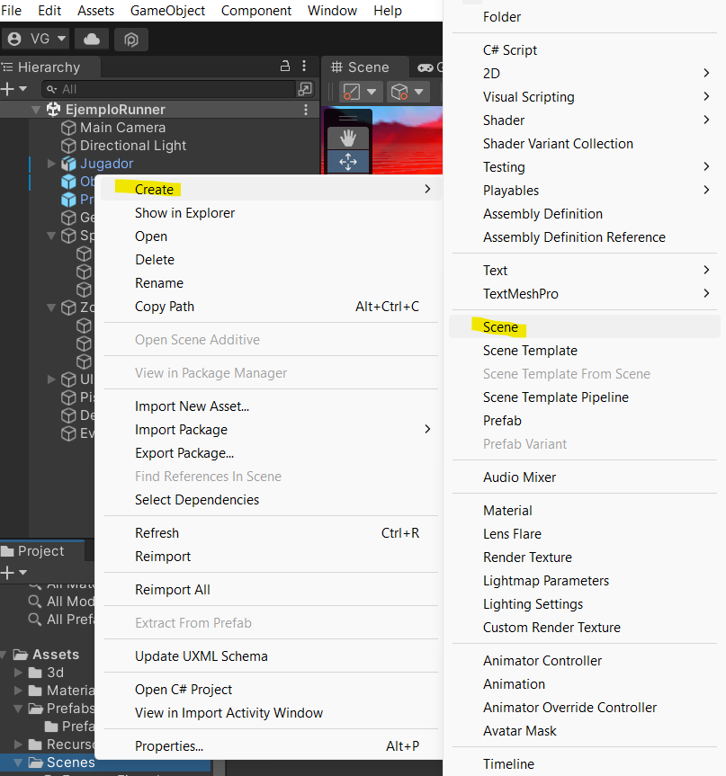

# 7. Empieza a crear tu propio juego

!!! info "Objetivo de esta sección"
    Llegaste al reto final: **crear tu propio juego** dentro del mismo proyecto de Unity.
    Vas a partir de cero en una escena nueva y a darle tu toque personal. ¡Esta es tu oportunidad de mostrar lo que aprendiste! 🎮

---

## ¿Por qué crear tu propio juego?

Ya exploraste el Runner y el Laberinto, modificaste scripts, cambiaste colores y viste cómo funcionan los eventos.
Ahora el reto de la **Hackathon Campfire** es que uses todos esos conocimientos para construir algo tuyo.

No tiene que ser perfecto — tiene que ser **tuyo**. Un juego hecho por ti, con tu idea, tu estilo y tu creatividad.

---

## Paso 1 – Crea una escena nueva

En Unity, cada nivel o pantalla es una **escena**. Vamos a crear una desde cero:

!!! example "Actividad – Nueva escena"
    1. En el panel **Project** (parte inferior de Unity), busca la carpeta **Scenes**.
    2. Haz clic derecho dentro de esa carpeta.
    3. En el menú que aparece, selecciona **Create → Scene**.
    4. Dale un nombre a tu escena (por ejemplo: `MiJuego`).
    5. Haz doble clic en la nueva escena para abrirla.

📸 **Así creas tu priopia escena**

!!! warning "No olvides guardar"
    Guarda tu escena seguido con **Ctrl + S** (Windows) o **Cmd + S** (Mac).

---

## Paso 2 – Arma el mínimo recomendado

Para tener un juego funcional, te recomendamos incluir al menos estos cuatro elementos:

| Elemento   | ¿Para qué sirve? |
|------------|-----------------|
| **Piso**   | El espacio donde se mueve el jugador (un Plane o un Cube aplanado). |
| **Jugador** | El personaje que controla quien juega (puedes reutilizar un prefab del proyecto). |
| **Premios/Obstáculos** | Piensa como se van obtener/perder puntos o como se puede "ganar/perder" el juego |
| **Mensajes** | textos en pantalla (TextMeshPro) que muestran información al jugador / diálogos |

!!! tip "¿De dónde saco los objetos?"
    - **3D Object → Plane** para el piso (clic derecho en Hierarchy → 3D Object → Plane).
    - Los prefabs del Runner o del Laberinto están en **Assets/Prefabs** — ¡puedes reutilizarlos!
    - Copia los que necesites de los scripts `PremioScript` o `PlayerController` como punto de partida para tus scripts nuevos.

---

## Paso 3 – Dale tu toque personal

Aquí es donde tu creatividad entra en juego. Algunas ideas para inspirarte:

- 🌵 **Tema desierto**: obstáculos de cactus, un personaje que salta.
- 🚀 **Tema espacio**: recoger estrellas, evitar asteroides.
- 🏙️ **Tema ciudad**: correr por edificios, recoger monedas.
- 🐾 **Tema animales**: un perrito que atrapa huesos.

No hay límite — el único requisito es que tenga el mínimo recomendado, que sea **divertido de jugar** y que resuelvas el reto que propone CAMPFIRE🔥.

---

!!! success "¡Felicitaciones!"
    Estás listo para crear tu propio juego para Hackathon Campfire. 🏆
    Recuerda: lo más importante no es que sea perfecto, sino que sea **tuyo** y que lo puedas explicar.
    No olvides que el equipo Campfire y sus mentores están para ayudarte a lograr esa meta que propondrás con tu equipo. !Levanta la mano cuando necesites nuestra ayuda!🙋‍♀️

---