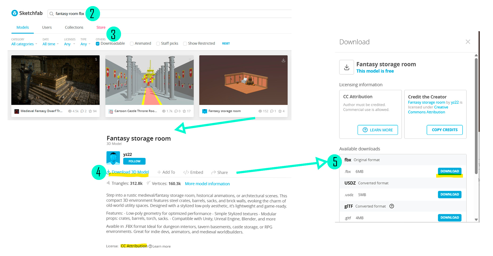

# 20. Arte: modelos 3D y animaciones

!!! info "Objetivo de esta sección"
    Aprender a conseguir modelos 3D, animaciones y otros recursos visuales gratuitos, e importarlos correctamente a tu proyecto de Unity para darle identidad propia a tu juego.

!!! tip "🙋‍♀️ Ayuda"
    🙋‍♀️ No olvides preguntarle a los mentores de Campfire si necesitas ayuda.

---

## ¿Qué recursos visuales necesita tu juego?

Antes de buscar assets, piensa qué necesitas:

| Tipo de recurso | Ejemplos |
|-----------------|---------|
| **Modelos 3D** | Personaje, enemigos, objetos coleccionables, decoración |
| **Animaciones** | Las que te permitan dar vida a tu personaje. Por ejemplo: Correr, saltar, atacar, idle (quieto), saludar...  |
| **Texturas / Materiales** | Colores, superficies (madera, piedra, metal) |
| **Skybox** | El "cielo" o fondo del mundo 3D |
| **Sprites 2D** | Iconos, botones, fondo del menú, elementos de UI |

Ahora que ya sabes que cosas puedes necesitar para darle vida a tu juego, vamos a analizar qué opciones tienes para conseguir esos recursos.

---

## Opción A – Sketchfab (modelos 3D listos)

[Sketchfab](https://sketchfab.com) es una plataforma con miles de modelos 3D gratuitos listos para descargar.
Esta te puede servir para los modelos del entorno, mesas, sillas, ambientación, etc.

!!! example "Actividad – Descargar un modelo de Sketchfab"
    1. Ve a **[sketchfab.com](https://sketchfab.com)**.
    2. Usa el buscador para encontrar el modelo que necesitas (ej: `fantasy room fbx`). La palabra fbx es para establecer el formato deseado.
    3. Filtra por **Downloadable** (descargable) en el menú lateral.
    4. Abre el modelo que te guste y asegurate de que tenga Licencia abierta (es importante atribuir a los artistas)
    5. Haz clic en **Download**.
    5. Elige el formato **FBX** (el que comprende Unity).
    6. Guarda el archivo en tu computador.

📸 **Visualiza los pasos aquí**  


!!! warning "Licencias"
    Algunos modelos requieren que pongas crédito al autor. Revisa la licencia antes de usarlos en tu juego.
    Si no entiendes cuáles son abiertas, llama a los mentores una vez selecciones el modelo que quieres para tu juego.

---

## Opción B – Modelos del Asset Store de Unity
Unity Asset Store es la tienda oficial de recursos de Unity, en ella encontrarás: objetos 3d/2d, animaciones, interfaz de usuario / menús, imágenes que simulan cielos (skyboxes), personajes y mucho más!
Su ventaja es que está integrada directamente con el Editor de Unity, así que descargar los recursos es mucho más fácil.

!!! example "Actividad – Descargar _props_ usando Unity Asset Store"
    1. Ve a **[Unity Asset Stote](https://assetstore.unity.com/)** desde el navegador
    2. Inicia sesión con la misma cuenta que usaste en UnityHub
    3. Haz una búsqueda en la barra (ej: Fantasy) y establece el filtro Price > Free ✅
    4. Busca el asset que más te sirva para tu juego... Puedes aplicar más filtos usando la barra del lado izquierdo de la pantalla (ej: 3D > Props)
    5. Selecciona el asset dando click en su imagen
    6. Luego dale click al botón "Add to my Assets" y luego a "Open in Unity".
    7. Desde Unity da click en "Download" y luego, cuando se termine la descarga, se habilitará el botón "Import".
    8. Y listo! Te aparecerá una nueva carpeta con los resursos descargados.


## Opción C – Hyper3D + Mixamo (modelo + animación automática)

Esta opción te permite generar un modelo 3D a partir de una foto y agregarle animaciones automáticamente.

### Paso C.1 – Generar el modelo con Hyper3D (Rodin)

!!! example "Actividad – Crear modelo 3D desde una imagen"
    1. Ve a **[hyper3d.ai](https://hyper3d.ai)** (o busca **Rodin 3D**).
    2. Sube una imagen de referencia del personaje u objeto que quieras.
    3. Espera a que se genere el modelo 3D (puede tomar 1–2 minutos).
    4. Descarga el modelo en formato **FBX** o **GLB**.

📸 **Foto aquí (interfaz de Hyper3D generando un modelo):**  


### Paso C.2 – Animar el modelo con Mixamo

[Mixamo](https://www.mixamo.com) es una herramienta gratuita de Adobe que pone animaciones a modelos 3D automáticamente.

!!! example "Actividad – Animar con Mixamo"
    1. Ve a **[mixamo.com](https://www.mixamo.com)** y crea una cuenta gratuita (o entra con Adobe ID).
    2. Haz clic en **Upload Character** y sube el modelo FBX que descargaste.
    3. Mixamo intentará auto-detectar la posición del esqueleto. Ajusta si es necesario.
    4. En la pestaña **Animations**, busca y elige las animaciones que necesitas (ej: `Run`, `Jump`, `Idle`).
    5. Para cada animación, haz clic en **Download**:
        - **Format**: FBX for Unity
        - **Skin**: With Skin (para la primera descarga) / Without Skin (para animaciones adicionales)
    6. Guarda todos los archivos descargados en una carpeta.

📸 **Foto aquí (Mixamo con auto-rigging y animaciones):**  


!!! tip "Tip – Varias animaciones"
    Si vas a usar varias animaciones del mismo personaje, descarga la primera con **With Skin** y las demás con **Without Skin**. Así el archivo es más liviano.

---

## Importar modelos a Unity

### Estructura de carpetas recomendada

Mantener el proyecto organizado evita errores y hace más fácil encontrar los archivos:

```
Assets/
├── Models/
│   ├── Personaje/
│   │   ├── Personaje.fbx
│   │   ├── Personaje_Run.fbx
│   │   └── Personaje_Jump.fbx
│   └── Ambiente/
│       └── Arbol.fbx
├── Textures/
│   └── Personaje_Diffuse.png
├── Materials/
│   └── Personaje_Mat.mat
└── Animations/
    └── Personaje_Run.anim
```

!!! example "Actividad – Importar un modelo FBX"
    1. En Unity, abre el panel **Project**.
    2. Crea las carpetas `Models`, `Textures` y `Materials` si no existen (clic derecho → **Create → Folder**).
    3. Arrastra el archivo `.fbx` desde el explorador de archivos de tu computador a la carpeta **Models** en el panel Project de Unity.
    4. Unity importará automáticamente el modelo. Verás el objeto en el panel Project.
    5. Arrastra el modelo desde el panel Project hasta la ventana **Scene** o la **Hierarchy** para colocarlo en la escena.

📸 **Foto aquí (arrastrar FBX al panel Project):**  


### Configurar el modelo importado

!!! example "Actividad – Revisar la configuración de importación"
    1. Selecciona el archivo `.fbx` en el panel **Project**.
    2. En el **Inspector** verás varias pestañas: **Model**, **Rig**, **Animation**, **Materials**.
    3. En la pestaña **Rig**:
        - Si el modelo tiene esqueleto (para animaciones), cambia **Animation Type** a **Humanoid** o **Generic**.
        - Haz clic en **Apply**.
    4. En la pestaña **Animation**, verifica que las animaciones estén listadas.

📸 **Foto aquí (Inspector con pestañas de importación FBX):**  


---

## Skybox y fondo del mundo

El **Skybox** es la textura que rodea toda la escena y simula el cielo o el ambiente.

!!! example "Actividad – Cambiar el Skybox"
    1. En Unity, ve al menú **Window → Rendering → Lighting**.
    2. En la ventana **Lighting**, busca la sección **Environment**.
    3. Haz clic en el círculo junto a **Skybox Material** y elige un material de skybox.
    4. Para usar uno personalizado, primero importa una textura de skybox desde la **Asset Store** o desde una imagen panorámica (formato equirectangular).

📸 **Foto aquí (ventana Lighting con Skybox resaltado):**  


!!! tip "Skyboxes gratuitos"
    En la **Asset Store** de Unity (Window → Asset Store) puedes buscar **skybox free** y encontrar varios paquetes gratuitos.

---

## Texturas y Materiales

Un **Material** define cómo se ve la superficie de un objeto (color, brillo, transparencia).  
Una **Textura** es la imagen que se "pega" sobre el material.

!!! example "Actividad – Crear un Material con textura"
    1. En el panel **Project**, haz clic derecho en la carpeta **Materials**.
    2. Selecciona **Create → Material**.
    3. Dale un nombre descriptivo (ej: `Suelo_Mat`).
    4. Con el material seleccionado, en el **Inspector** verás el campo **Albedo**.
    5. Haz clic en el círculo junto a **Albedo** y elige una textura importada, o haz clic en el color para cambiar el color directamente.
    6. Arrastra el material desde el panel Project al objeto en la **Scene** o la **Hierarchy**.

📸 **Foto aquí (Inspector del Material con Albedo resaltado):**  


---

## Elementos de UI (Interfaz de Usuario)

Los elementos de UI (botones, textos, barras de vida, puntaje) viven dentro de un **Canvas** en Unity.

!!! example "Actividad – Agregar imagen de UI"
    1. En la **Hierarchy**, haz clic derecho y selecciona **UI → Image**.
    2. Se crea automáticamente un `Canvas` con un objeto `Image` dentro.
    3. Con la `Image` seleccionada, en el **Inspector** busca **Source Image**.
    4. Haz clic en el círculo y selecciona el sprite que quieres mostrar.
    5. Ajusta la posición y tamaño con las herramientas de **Rect Transform**.

📸 **Foto aquí (Canvas con Image en Hierarchy e Inspector):**  


!!! tip "Sprites 2D para UI"
    Importa imágenes PNG a Unity (arrástralas al panel Project).  
    Selecciona la imagen importada y en el **Inspector** cambia **Texture Type** a **Sprite (2D and UI)**.  
    Haz clic en **Apply**.

---

## Retos de arte

¡Pon en práctica lo que aprendiste! Elige uno o más retos:

!!! example "Reto 1 – Personaje propio"
    Descarga o genera un modelo 3D y reemplaza el personaje por defecto de tu escena.

!!! example "Reto 2 – Mundo con estilo"
    Cambia el Skybox y crea al menos 2 materiales con colores o texturas distintos para que tu escena tenga un estilo visual único.

!!! example "Reto 3 – Personaje animado"
    Usa Mixamo para agregar al menos 2 animaciones (idle y correr/saltar) a tu personaje e intégralas en el **Animator Controller** de Unity.

---

## ✅ Checklist de arte

Marca cada ítem cuando lo hayas completado:

<ul class="cf-checklist">
  <li><label><input type="checkbox"> Descargué o generé al menos un modelo 3D (Sketchfab o Hyper3D)</label></li>
  <li><label><input type="checkbox"> Importé el modelo FBX en Unity con la estructura de carpetas correcta</label></li>
  <li><label><input type="checkbox"> El modelo aparece en la escena sin errores</label></li>
  <li><label><input type="checkbox"> Configuré el tipo de <strong>Rig</strong> del modelo en el Inspector</label></li>
  <li><label><input type="checkbox"> Cambié o personalicé el <strong>Skybox</strong> de mi escena</label></li>
  <li><label><input type="checkbox"> Creé al menos un <strong>Material</strong> con color o textura propia</label></li>
  <li><label><input type="checkbox"> Agregué al menos un elemento de <strong>UI</strong> (imagen o texto) a la escena</label></li>
</ul>

---

🙋‍♀️ No olvides preguntarle a los mentores de Campfire si necesitas ayuda.
